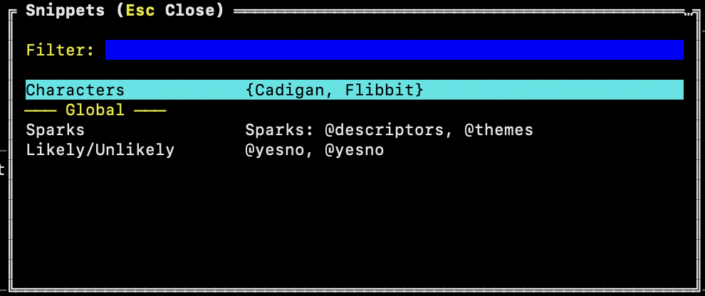

# Terminal App for Tracking Solo TTRPG Sessions


This started out as a project to learn the Go programming language and turned into something I've been using to track my solo TTRPG sessions.

People expressed interest in it, so I thought I'd put it up here on Github.

To install, see the [Installing](#installing) section below.

## Features
* Create multiple games and track multiple sessions per game
* Create simple characters for quick reference in the app
* Support for tags and quick notations based on [Lonelog](https://zeruhur.itch.io/lonelog)
* Dice Rolling
* Searching game sessions
* Random Tables
* Rolling on lists and random tables
* Snippets for saving frequently used dice rolls and expressions for quick reuse
* Mouse free navigation
* Import/Export session logs

## Games
Games are just a name for adding session logs to. You'll need to add a game before adding logs.

## Sessions
Sessions is just a text area where you can type out your log. There's no formatting available here. It's just a simple text editor.

You can import/export session logs however, so those who like to use Markdown can still do so. It just won't be formatted in the terminal.

### Lonelog Tags


Check out [Lonelog](https://zeruhur.itch.io/lonelog) for using tags in your TTRPG session logs.

When logging your session, you can press keys (F2 = Character Action, F3 = Oracle Question, F4 = Dice) to quickly insert a template. Press Ctrl+T to open up the tag modal to select a template to insert.

The Active Tags section displays the list of "open" tags from all of the logs in the game.

The Notes Tags section includes tags that are in the Notes section of the game.

Picking one of those tags will insert it into the log where you can fill out the details.

### Configuring Tags
When the application starts for the first time it creates a `config.yaml` file with sensible defaults. You can edit this file to change the available tags. Press **F1** in the app to see the exact path to your config file.

See the [Configuration](#configuration) section for full details.

## Notes


Separate from sessions is a notes section. Notes are for tracking things that live on beyond sessions, like key NPCs, adventure hooks, locations.

## Searching


You can search notes and sessions, then quickly jump to the entry by selecting it from the list of results.

## Characters


There are 2 sections for managing characters in the app. The top section is where you add a character's information (name, system, role, species). The bottom section is the sheet where you track attributes.

The sheet is a list of name/value entries. Entries can be standalone or grouped under a section header. Sections keep related entries together and move as a group.

It's recommended to track only simple things here. It's not a rich character sheet by any means.

Depending on the game you're playing, the entire character sheet may fit in this area.

## Random Tables


You can manage random tables right within the application. Once you have tables, you can roll on them in the dice roller. You can also import and export tables for easy management.

## Rolling Dice


You can roll dice from anywhere in the app. It follows the typical dice notation and allows tagging rolls with a label.

When launching the roller from within the session log, you can insert the roll result where the cursor is in the text area.

### Rolling On Lists


Sometimes you want to select from a random list of things. The dice roller allows you to define a list and pick a random entry. You can also adjust the number of entries by adding a number for it. The dice roller will include the entry the number of times provided, increasing the likelihood of it being selected.

### Rolling On Tables


When you've added random tables to the application, you can easily roll on them by typing `@` in the roller. The list of tables will appear. As you start typing, the list will filter to matching results. If the top entry in the list matches, hit the tab key to select it.


The roller will then pick an entry from the table.

You can include a table with other dice or lists and the roller will select an entry from it.

### Roll Snippets


You can save frequently used rolls as a snippet, then easily select and use it in the roller. It speeds up rolling, especially on multiple tables. You can get to the Snippets from the Roll modal.

You can have game specific snippets and global snippets which are available to all games.

# Building from Source

Since SoloTerm is built with Go it only needs a couple dependencies to build it from source. 

## 1. Dependencies
1) Make sure you have Go installed in whichever way is easiest for your OS.
2) You will also need `make` on your system to be able to build.

## 2. Build for your target
The `Makefile` is structured to build for individual systems or it can build all of the binaries/executables.

The build options are:
- all
- clean
- help
- linux
- mac
- windows

If you need some help understanding what your options are, just run `make help`.

```bash
> make help
all: Builds soloterm for all systems.
clean: Removes any build binaries / executables from the bin folder.
help: Show help for each of the Makefile recipes.
linux: Build the arm64 and x86/x64 binaries for Linux systems.
mac: Build the arm64 and x86/x64 binaries for Mac systems.
windows: Build the arm64 and x86/x64 executables for Windows systems.
```

**Optional:** Make a symbolic link that points to your built version of SoloTerm so you can test local changes/modifications quickly:

```bash
sudo ln -s ~/soloterm/bin/soloterm_Linux_x86_64 /usr/local/bin/soloterm
soloterm
```

# Installing

SoloTerm is a single binary with no dependencies. Download it, make it executable, and run it.

## 1. Download the binary

Go to the [Releases](https://github.com/curtp/soloterm/releases) page and download the file that matches your system:

| OS      | Architecture              | File to download              |
|---------|---------------------------|-------------------------------|
| macOS   | Apple Silicon (M1/M2/M3)  | `soloterm_Darwin_arm64`       |
| macOS   | Intel                     | `soloterm_Darwin_x86_64`      |
| Linux   | ARM (Raspberry Pi, etc.)  | `soloterm_Linux_arm64`        |
| Linux   | 64-bit (most desktops)    | `soloterm_Linux_x86_64`       |
| Windows | ARM                       | `soloterm_Windows_arm64.exe`  |
| Windows | 64-bit (most desktops)    | `soloterm_Windows_x86_64.exe` |

Not sure which Mac you have? Apple menu → About This Mac. If it says Apple M1/M2/M3, download the ARM build. If it says Intel Core, download the x86_64 build.

## 2. Make it executable (macOS / Linux only)

Open a terminal in the folder where you downloaded the file and run:

```bash
chmod +x soloterm_*
```

If macOS blocks the app, go to **System Settings → Privacy & Security** and click **Open Anyway**.

## 3. Run it

```bash
./soloterm_Darwin_arm64   # replace with your downloaded filename
```

**Optional:** Move the binary somewhere on your PATH so you can launch it from anywhere:

```bash
mv soloterm_Darwin_arm64 /usr/local/bin/soloterm
soloterm
```

On Windows, run the `.exe` from PowerShell, Command Prompt, or Windows Terminal. Double-clicking it may cause the window to close immediately when the app exits, so running it from a terminal is recommended.

# Configuration

When the app starts for the first time it creates a `config.yaml` file with sensible defaults. You can edit this file to change how the app behaves. Press **F1** to see where the file is on your machine. The default locations are:

| Platform | Path |
|----------|------|
| macOS    | `~/Library/Application Support/soloterm/config.yaml` |
| Linux    | `~/.config/soloterm/config.yaml` |
| Windows  | `%AppData%\soloterm\config.yaml` |

## Core Tag Templates (`core_tags`)

These are the templates inserted when you press **F2** (Character Action), **F3** (Oracle), and **F4** (Dice). You can change the `template` value under each entry to whatever works for your game system.

```yaml
core_tags:
  action:
    template: "@ \nd: ->\n=> "
  oracle:
    template: "? \nd: ->\n=> "
  dice:
    template: "d: ->\n=> "
```

If you leave a template blank or remove the entry entirely, the app will put the default back on the next startup.

## Tag Types (`tag_types`)

This is the list of tags shown in the tag selector (**Ctrl+T**). Each one has a `label` shown in the UI and a `template` that gets inserted when you pick it.

```yaml
tag_types:
  - label: Location
    template: "[L: | ]"
  - label: NPC
    template: "[N: | ]"
```

Add, remove, or change these to suit your game.

## Tag Exclude Words (`tag_exclude_words`)

Any tag whose data section contains one of these words won't show up in the Active Tags list. The matching is case-insensitive. It's handy for hiding tags you've already resolved or closed out.

```yaml
tag_exclude_words:
  - closed
  - abandoned
```

## Database Location (`database_dir`)

By default the database is stored alongside the log file in the platform data directory. If you want to keep it somewhere else, like a Dropbox folder so your sessions sync across machines, just set this to the directory you want.

```yaml
database_dir: /home/user/Dropbox/soloterm
```

The database file is always named `soloterm.db`, so just point this at the folder.

If you set the `DB_PATH` environment variable to a full file path, that takes priority over this setting.

# Contributing/Reporting Issues
This is a little side project that I used to learn Go which expanded into what it is today. While I
didn't intend for this to turn into full on open source project, I'm happy to provide the source here.

* If you want to fork the code and alter it, go for it. The license is MIT, so do what you want.
* PRs welcome! But please file bugs and or enhancements and refer to them.
* If you find a problem with the app, feel free to open an issue here and if I get time I'll check it out. Or, if you like, fix it and submit a PR.
